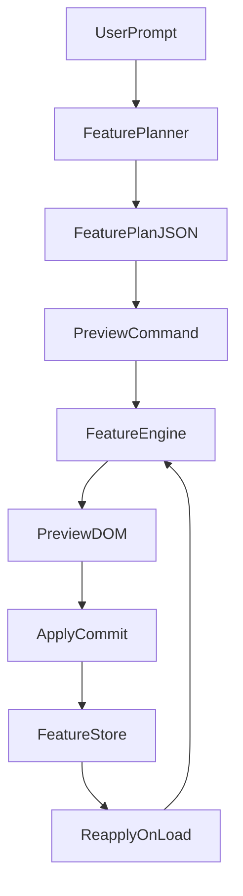

# Planner → Engine → Preview → Commit v1

## Scope Summary

- Add a constrained, deterministic feature pipeline that replaces AI HTML/CSS generation for Add flow.
- Keep existing Remove/Customize flows intact; only Add + chat uses the new planner/engine.
- Use sidepanel inline preview controls as the UI for Apply/Undo.
- Planner runs client-only for v1 (no Edge Function changes).

## Proposed Modules

- [`contextExtractor.js`](contextExtractor.js) — build limited DOM context from a picked element.
- [`featureRegistry.js`](featureRegistry.js) — registry of feature types, allowed params, preview support, undo logic.
- [`featureEngine.js`](featureEngine.js) — deterministic executor for preview/commit using safe primitives.
- [`featurePlanner.js`](featurePlanner.js) — client-only planner that outputs `{feature_type, parameters, confidence, warnings}`.
- [`featureStore.js`](featureStore.js) — committed features storage (chrome.storage.local) + replay.

## Key Integration Points

- [`sidepanel.js`](sidepanel.js) — replace AI HTML/CSS generation for Add chat with planner JSON, show preview cards, and wire Apply/Undo/Refine.
- [`contentScript.js`](contentScript.js) — add message handlers for `PLAN_FEATURE`, `PREVIEW_FEATURE`, `COMMIT_FEATURE`, `UNDO_FEATURE` and call engine/store.
- [`manifest.json`](manifest.json) — add new scripts to content scripts order.

## Data Flow (v1)



## Step-by-step Implementation

### 1) Context Extractor (content script)

- Implement `extractContext(selector)` in [`contextExtractor.js`](contextExtractor.js) to return:
  - `selector`, `boundingBox`, `computedStyles` (font/color/spacing), `parentInfo` (2 levels)
- Add a message handler in [`contentScript.js`](contentScript.js) for `GET_ADD_CONTEXT` that returns this structure.

### 2) Feature Registry

- Create [`featureRegistry.js`](featureRegistry.js) with 3–5 feature types:
  - `ResizablePanel`, `HideElement`, `MoveElement`, `StickyElement`
- Each entry defines:
  - `allowedTargets`, `parametersSchema`, `supportsPreview`, `apply`, `undo`, `previewStyleClass`

### 3) Deterministic Engine

- Implement [`featureEngine.js`](featureEngine.js) with `applyFeature(plan, mode)` and `undoFeature(plan, mode)`.
- Modes:
  - `preview`: insert wrappers/badges + store transient handles
  - `commit`: remove preview, apply definitive change, return a durable feature record
- Add `data-webedit-feature-id` attributes for dedupe and idempotent reapply.

### 4) Planner Interface (client-only)

- Implement [`featurePlanner.js`](featurePlanner.js) that:
  - Accepts `{prompt, context}`
  - Returns planner JSON only (no code):
    ```json
    {"feature_type":"ResizablePanel","parameters":{...},"confidence":0.74,"warnings":[]}
    ```

- Provide a placeholder heuristic for v1 (string matching + context hints), with clear warnings.

### 5) Preview/Commit flow wiring (sidepanel)

- In [`sidepanel.js`](sidepanel.js):
  - After Add flow description, call `GET_ADD_CONTEXT` from content script.
  - Call `FeaturePlanner.plan(...)` (client-only).
  - Send `PREVIEW_FEATURE` to content script with the plan.
  - Show a preview card in chat with Apply / Undo / Refine.
  - `Apply` sends `COMMIT_FEATURE` and persists result.
  - `Undo` sends `UNDO_FEATURE` and removes preview.

### 6) Storage + Reapply

- Implement [`featureStore.js`](featureStore.js):
  - Store committed feature records keyed by `origin+pathname`.
  - Add `restoreCommittedFeatures()` in content script on load and in SPA hooks to reapply deterministically.

### 7) Undo/Redo

- Add two stacks in engine/store:
  - `previewStack` (ephemeral)
  - `commitStack` (persisted + rehydrated)
- Wire to existing `UNDO_LAST`/`REDO_LAST` commands for committed features.

## Files to Touch

- [`sidepanel.js`](sidepanel.js) — Add preview UI and planner integration.
- [`contentScript.js`](contentScript.js) — Add new message handlers, context extraction, reapply on load.
- [`manifest.json`](manifest.json) — Add new scripts in correct order.
- New files:
  - [`contextExtractor.js`](contextExtractor.js)
  - [`featureRegistry.js`](featureRegistry.js)
  - [`featureEngine.js`](featureEngine.js)
  - [`featurePlanner.js`](featurePlanner.js)
  - [`featureStore.js`](featureStore.js)

## Testing Checklist

- Add flow: pick element → describe feature → preview shows → Apply persists.
- Reload page: committed features reapply; preview does not.
- SPA navigation: committed features reapply once; no duplicates.
- Undo/redo works for committed features.